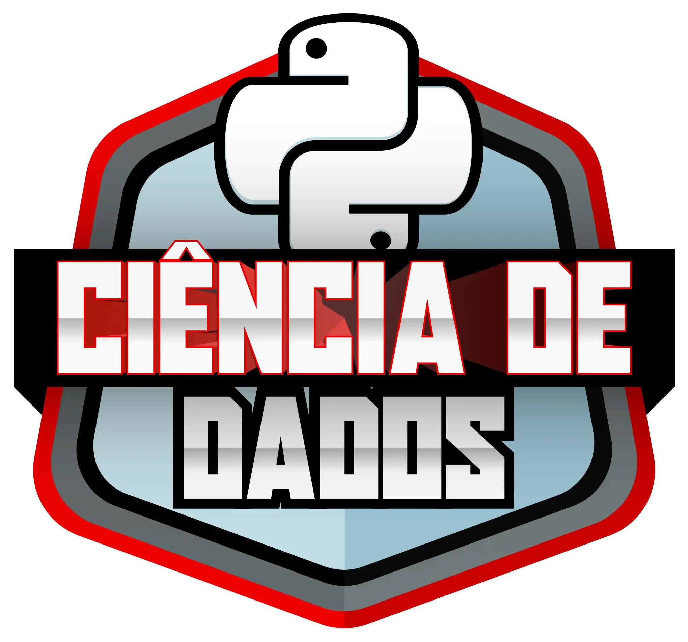

# Pipeline ETL utilizando o [*Chocolate Bar Ratings*](https://www.kaggle.com/datasets/rtatman/chocolate-bar-ratings/data) dataset  
### Desafio proposto no módulo *Explorando IA Generativa em um Pipeline de ETL com Python*, que compõe o *Santander Bootcamp 2023 - Ciência de Dados com Python*    

O dataset escolhido foi obtido no *Kaggle* e contém mais de 1700 avaliações de especialistas de barras de chocolates distintas, além de informações sobre sua região de origem, porcentagem de cacau, variedade do grão de cacau e onde os grãos foram cultivados. As notas variavam entre 1 e 5, com 3.75 sendo o valor qe corte para ser considerada uma barra chocolate louvável.  
Os dados foram extraídos no *GoogleColab*, avaliados quanto a presença de duplicações, nulos e discrepantes. A coluna *Bean_Type* foi excluída por possuir um grande número de dados nulos, e a coluna *Cocoa_Percentage* foi transformada em *float* e excluiu-se os valores maiores do que 100. Ao final, ficamos com 8 colunas e 1714 registros.  
Elaboramos quatro tabelas para identificar as empresas, localidades, países e porcentagens de cacau com as melhores notas, e as extraímos em arquivos *.csv*.
